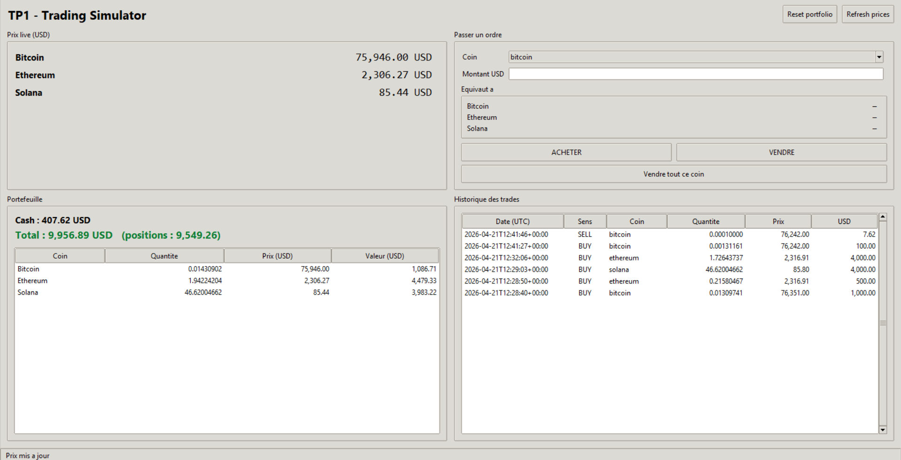

# TP1 - Crypto Trading Simulator

Small project that fetches live prices for bitcoin / ethereum / solana
from CoinGecko, simulates buy/sell orders starting from 10 000 USD of
cash, and saves everything in a JSON file.

## Requirements

- Python 3.10+
- The `requests` library

## Why I used a virtual environment (venv)

My Python install is managed by `uv`, so running `pip install requests`
globally gave me an error:
`error: externally-managed-environment`.

To avoid this I created a local virtual environment inside the project
(`.venv/`) and installed `requests` there. This way:

- The project has its own isolated dependencies
- I don't touch the system Python
- Anyone else who clones the repo can just recreate the same env and
  get the exact same setup

Commands I ran once, from the project folder:

```
python -m venv .venv
.venv\Scripts\python -m pip install requests
```

After that, as long as the venv is activated, I can just run
`python trading_simulator.py` normally.

To activate the venv (Windows PowerShell):

```
.\.venv\Scripts\Activate.ps1
```

If PowerShell blocks the activation script, run this once:

```
Set-ExecutionPolicy -Scope CurrentUser RemoteSigned
```

## How to run

From inside the `tp1_trading_simulator` folder, with the venv activated:

Console version:
```
python trading_simulator.py
```

Graphical version (Tkinter):
```
python trading_gui.py
```

## Screenshot of the GUI



The interface shows the live prices, the order panel (with a live
conversion of the USD amount into each crypto), the portfolio with
positions valued at market, and the trade history.

## What the project does (Steps 1 to 5)

1. Folder layout: `trading_simulator.py`, `README.md`, and
   `portfolio.json` (created automatically on the first run).
2. Single dependency: `requests`.
3. Calls the CoinGecko `simple/price` endpoint to get bitcoin, ethereum
   and solana prices in USD. The raw dict is printed first, then each
   price on its own line.
4. Portfolio stored as a dict:
   ```
   {"cash": 10000, "positions": {}, "trades": []}
   ```
5. `save_portfolio()` writes to `portfolio.json`, `load_portfolio()`
   reads it back (returns a fresh portfolio if the file doesn't exist).

On top of that I added a menu to buy/sell and show a summary, plus a
graphical interface doing the same thing.

## Files

- `trading_simulator.py` : main script (functions + console menu)
- `trading_gui.py` : Tkinter GUI
- `portfolio.json` : generated on the first run
- `README.md` : this file

## Note about the CoinGecko API (rate limit)

While testing the project I hit the rate limit of the free CoinGecko API.
When that happens the API answers with `HTTP 429 Too Many Requests` and
the prices stop updating in the GUI (the status bar at the bottom shows
the error).

From my tests the free tier allows roughly 10-30 requests per minute on a
rolling window. Each BUY, SELL and "Refresh prices" click does one API
call, so if you click too fast you can get blocked.

If it happens, just wait around 1 minute without clicking anything and it
works again. Basically : don't spam the buttons.
